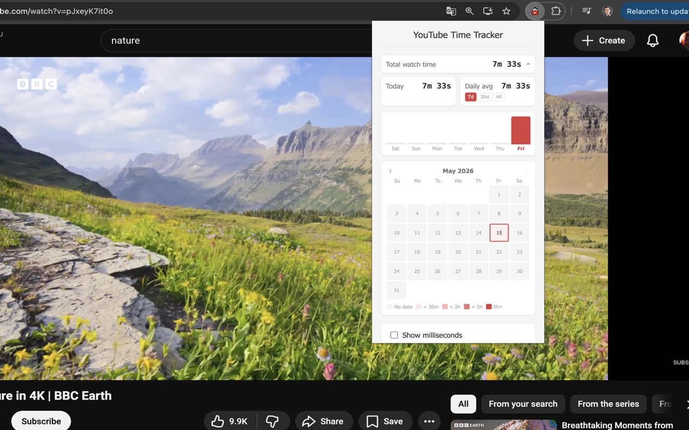
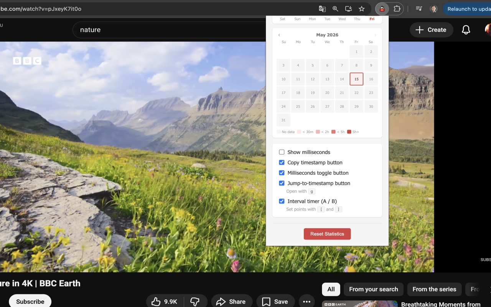

# YouTube Milliseconds Timer

Chrome extension that adds millisecond precision to YouTube video timestamps, an interval timer A→B, one-click copy, and a watch time stats dashboard.

**[Website](https://1gory.github.io/youtube-milliseconds-extension/)** &nbsp;·&nbsp; **[Privacy Policy](https://1gory.github.io/youtube-milliseconds-extension/privacy-policy.html)**

[](https://chromewebstore.google.com/detail/youtube-milliseconds-time/bchlendkhiidadpakkfgnpeklmifffcp)

## Screenshots



## Features
- Millisecond-accurate timestamps in M:SS.mmm format (e.g. 1:23.456)
- One-click copy button next to the timestamp — copies the exact moment to clipboard
- Interval timer A→B — mark two points with `[` and `]` keys (or buttons), see the exact delta down to the millisecond, copy it with one click, visual markers on the progress bar
- Watch time stats dashboard: total time, today, daily average (7d / 30d / all), 7-day bar chart, monthly calendar heatmap with month navigation
- Toggle milliseconds and interval timer on/off via the extension popup
- Works with all YouTube videos, playlists, and Shorts
- No overlays, no clutter — integrates directly into the native player

## Installation

### Manual installation (without Chrome Web Store)

**English**

1. Go to the [Releases page](https://github.com/1gory/youtube-milliseconds-extension/releases) and download the latest `youtube-milliseconds-vX.X.X.zip`  
   *(or on the main page click **Code → Download ZIP** and unpack it)*
2. Unpack the ZIP — you will get a folder with the extension files
3. Open Chrome and type `chrome://extensions/` in the address bar, press Enter
4. Turn on **Developer mode** — the toggle is in the top-right corner of the page
5. Click **Load unpacked** and select the unpacked folder
6. The extension icon will appear in the toolbar. Pin it by clicking the puzzle icon → pin next to the extension name
7. Open any YouTube video — millisecond timestamps will appear right away

> Works in any Chromium-based browser: Chrome, Brave, Edge, Opera, Vivaldi.

---

**Русский**

1. Перейдите на [страницу релизов](https://github.com/1gory/youtube-milliseconds-extension/releases) и скачайте последний файл `youtube-milliseconds-vX.X.X.zip`  
   *(или на главной странице репозитория нажмите **Code → Download ZIP**)*
2. Распакуйте ZIP-архив — появится папка с файлами расширения
3. Откройте Chrome и введите в адресной строке `chrome://extensions/`, нажмите Enter
4. Включите **Режим разработчика** — переключатель в правом верхнем углу страницы
5. Нажмите **Загрузить распакованное расширение** и выберите распакованную папку
6. Иконка расширения появится на панели инструментов. Закрепите её: нажмите иконку пазла → значок булавки рядом с названием расширения
7. Откройте любое видео на YouTube — миллисекунды появятся сразу

> Работает в любом браузере на основе Chromium: Chrome, Brave, Edge, Opera, Vivaldi.

## Usage
- **Timestamps**: Millisecond precision is shown automatically on all YouTube videos
- **Copy button**: Click the clipboard icon next to the time to copy the exact timestamp
- **Interval timer**: Press `[` to set point A, `]` to set point B — or use the A/B buttons in the player. The delta appears above the controls
- **Settings**: Click the extension icon to toggle features and view watch time stats
- **Time Tracking**: Only counts time when video is actively playing

## Development

### Run tests
```bash
npm install
npm test
```

### Load unpacked
1. Open `chrome://extensions/`
2. Enable Developer mode
3. Click "Load unpacked" and select this folder

### Package for Chrome Web Store
```bash
zip -r youtube-milliseconds-v1.4.0.zip manifest.json popup.html popup.css styles.css js/ icons/
```

The zip includes only the files required by the extension. Do **not** include `node_modules/`, `tests/`, screenshots, or any markdown files.

## Privacy
This extension does not collect any personal data. All statistics are stored locally on your device and never transmitted externally.

Full privacy policy: https://1gory.github.io/youtube-milliseconds-extension/privacy-policy.html

## License
[MIT](LICENSE) © Igor Pershin
